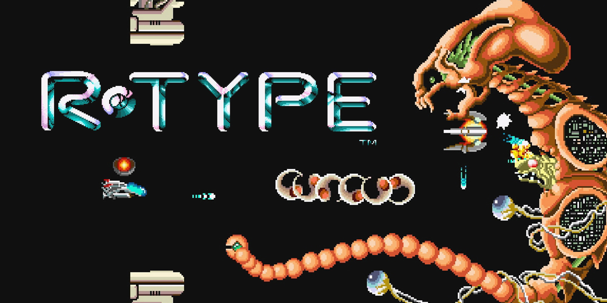

# R-Type: Overview

R-Type is a C++ fan-game remake of the arcade classic R-Type.  
It also include extra features like multiplayer and online coop !

R-Type come with a server and a client, and is both available on Windows and Linux.

## Table of Contents

- [R-Type: Overview](#r-type-overview)
- [Table of Contents](#table-of-contents)
- [Getting Started](#getting-started)
    - [Quick Start: Windows](#quick-start-windows)
    - [Quick Start: Linux](#quick-start-linux)
- [License](#license)
- [Our Dev Team](#our-dev-team)

## Getting Started

Follow the quick start guide for either
[Windows](#quick-start-windows) or [Linux](#quick-start-linux),
depending on what you're using.

### Quick Start: Windows

Prerequisites:
- Windows 10 or newer
- Git
- Visual Studio 2022
- CMake >= 3.5
- Vcpkg >= 2022.12.14

First, download R-Type by cloning the repository.

```cmd
> git clone https://github.com/Epitech-Space-Invaders-2025/R-Type.git
```

Then compile it with CMake.

```cmd
> cd .\R-Type
> cmake -B [build directory] -S . "-DCMAKE_TOOLCHAIN_FILE=[path to vcpkg]/scripts/buildsystems/vcpkg.cmake"
> cmake --build [build directory]
```

Finally you can launch it from cmd prompt

```cmd
> .\[build directory]\r-type.exe
```

### Quick Start: Linux

Prerequisites for Linux:
- Git
- g++
- CMake >= 3.5
- Vcpkg >= 2022.12.14

First, download R-Type by cloning the repository.

```sh
$ git clone https://github.com/Epitech-Space-Invaders-2025/R-Type.git
```

Then compile it with CMake.

```sh
$ cd ./R-Type
$ cmake -B [build directory] -S . "-DCMAKE_TOOLCHAIN_FILE=[path to vcpkg]/scripts/buildsystems/vcpkg.cmake"
$ cmake --build [build directory]
```

Finally you can launch it

```sh
$ ./[build directory]/r-type
```

## License

The code in this repository is licensed under the [MIT License](./LICENSE).

## Our Dev Team

| [<br><sub>Bill On</sub>](https://github.com/Bill-ON) | [<br><sub>Tomas Proust</sub>](https://github.com/TomasProust) | [<br><sub>Guilhem Santé</sub>](https://github.com/Guilhem-Sante) | [<br><sub>Hahrin Seo</sub>](https://github.com/gggabrielles) | [<br><sub>Christian Tran</sub>](https://github.com/ccchristiant) |
| :---: | :---: | :---: | :---: | :---: |